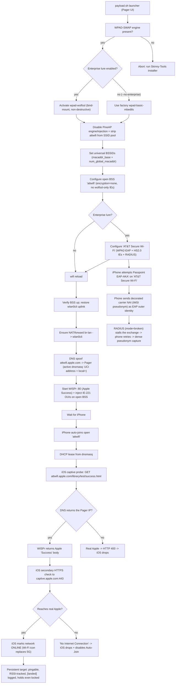
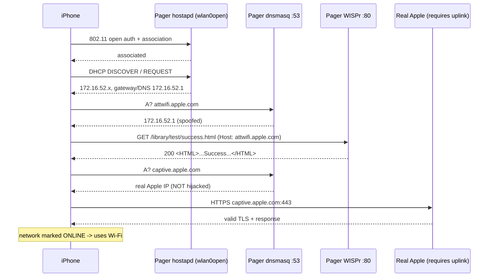

# ATT-Open-Steer

Find and hold hidden **AT&T iPhones** by impersonating the carrier's own
managed Wi-Fi profile, then keep the phone connected as a persistent,
RSSI-trackable target. Optionally, capture the phone's EAP-AKA' **pseudonym**
(a stable per-SIM IMSI NAI) to correlate its rotating private MAC addresses.

> Primary file: `att-open-steer.py` · Launcher: `payload.sh`
> Status: **open-`attwifi` persistence verified working** (stays connected
> unlocked and locked, with internet).

---

## 1. What this accomplishes, and why it works

Every AT&T iPhone ships with **carrier-managed Wi-Fi profiles** provisioned
from the SIM/eSIM carrier bundle. The two that matter here are:

| Profile | Security | Role in this attack |
|---|---|---|
| **`attwifi`** | **Open** (managed, auto-join) | The **persistent connection / tracking** target. iOS joins it without credentials and validates it against a carrier-specific URL. |
| **`AT&T Secure Wi-Fi`** | **WPA2-Enterprise / Passpoint** (EAP-AKA') | The **pseudonym lure**. iOS attempts EAP-AKA' and leaks its carrier NAI before any real auth. |

Because `attwifi` is a **managed open profile**, an AT&T iPhone will
**auto-join our fake `attwifi` AP with no user interaction**. But joining is
only half the battle: iOS runs a **captive-network / connectivity check** and
will silently drop the network (and turn Auto-Join off) unless that check
passes. This payload performs **DNS + HTTP spoofing** so the check returns
Apple's expected "Success", *and* relies on the Pager having a **real internet
uplink** so iOS's secondary HTTPS check to Apple also succeeds.

The result: the phone believes it is on a genuine AT&T `attwifi` hotspot, gets
real internet through the Pager, and **stays associated** — so it can be
pinged, its RSSI tracked, and its presence confirmed.

The pseudonym path is a **separate capability** on a separate SSID: a fake
Passpoint `AT&T Secure Wi-Fi` BSS with a local RADIUS that stalls the EAP
exchange. The phone retries endlessly and hands us the same carrier NAI every
time, which ties iOS's per-SSID randomized MACs to one physical device.

### Why this is not a single trick

Making an AT&T iPhone stay on a fake hotspot requires **many mechanisms at
once**. Each one was discovered by live testing on a real Pager + iPhone; if
any is missing, the phone connects and then drops within seconds.

---

## 2. Requirements (extra tooling on a stock Pager)

Everything is provisioned by the Skinny-Tools installer
(`online-install.sh`). No opkg package is installed that would remove a factory
one.

| Need | Package / asset | Used for | Needed for open-only? |
|---|---|---|---|
| Python 3 + stdlib modules | `python3`, `python3-light`, `python3-base`, `python3-email`, `python3-urllib`, `python3-logging`, `python3-decimal`, `python3-codecs` | orchestrator, RADIUS, WISPr (`http.server`) | **yes** |
| `hostapd_cli` | `hostapd-utils` | 802.11k/v steering control commands | only for steering |
| nftables (JSON) | `nftables-json` | NAT/forward `br-lan → wlan0cli` | **yes** |
| packet capture | `tcpdump`, `libpcap` | diagnostics / optional sniffing | optional |
| **Passpoint `wpad`** | staged `wpad-wolfssl` + `libwolfssl.so.5.9.1.e624513f` via the **WPAD-SWAP** engine | Hotspot 2.0 / Interworking / EAP-AKA' IEs and 802.11k/v options | **no** — only for the pseudonym lure |
| Shared ATT helpers | `radius-reject.py`, `v28_wispr.py`, `v28_ie221.py`, `v28_dhcpd.py`, `v28_isolate.sh` (in `payloads/user/Skinny-Tools/ATT/`) | RADIUS, captive portal, IE-221, DHCP | **yes** (WISPr, IE-221) |
| WPAD-SWAP engine | `payloads/user/utilities/WPAD-SWAP/wpad-swap.sh` | non-destructive wpad-wolfssl hot-swap | only for pseudonym mode |

> The factory Pager `wpad-basic-mbedtls` **strips** Passpoint/HS2.0/EAP-AKA
> and the `bss_transition`/`ieee80211k` options. The WPAD-SWAP engine
> **bind-mounts** `wpad-wolfssl` only while active and always restores the
> factory binary on exit; a reboot is a universal undo.

---

## 3. How it works, step by step

1. **AT&T iPhone already trusts `attwifi`.** The carrier bundle provisions it
   as a managed **open** network with auto-join. No credentials, no EAP.
2. **We stand up a fake open `attwifi` BSS** on the 2.4 GHz radio with a
   **universally-administered BSSID** (iOS silently filters locally-administered
   MACs).
3. **PineAP is silenced.** PineAP's SSID pool auto-populates and by then
   contains `attwifi` and `AT&T Secure Wi-Fi`; left on, it injects *extra*
   `attwifi` BSSIDs. iOS sees several `attwifi` APs, roams onto a fake with no
   captive server, fails validation, and turns Auto-Join off. We disable the
   PineAP engine/injection and strip those SSIDs from the pool.
4. **The phone auto-joins** and gets a DHCP lease from the Pager's dnsmasq
   (`172.16.52.x`, gateway/DNS `172.16.52.1`).
5. **We DNS-spoof the carrier probe host.** iOS validates the network with
   `GET http://attwifi.apple.com/library/test/success.html`
   (`User-Agent: CaptiveNetworkSupport-… wispr`). We override
   **`attwifi.apple.com → 172.16.52.1`** in the **active** dnsmasq config, and
   add `local=/attwifi.apple.com/` so dnsmasq is authoritative and the real
   SVCB/HTTPS record can't leak a real Apple IP.
6. **We answer the probe.** A local WISPr server on **:80** returns Apple's
   `<HTML><HEAD><TITLE>Success</TITLE>…` body.
7. **We do NOT spoof `captive.apple.com`.** iOS also checks that name over
   **HTTPS (443)**; pointing it at the Pager (no TLS listener) yields a
   connection reset that makes iOS treat the network as captive. Leaving it
   alone lets it reach real Apple.
8. **The phone gets real internet** through the Pager's uplink
   (`br-lan → wlan0cli` NAT/forward), so iOS's secondary HTTPS check succeeds
   and it marks the network **online** (Wi-Fi icon replaces 5G).
9. **Persistence.** With inactivity polling disabled and the phone validated,
   it stays associated — even locked — and is logged as a `[landed]` target.
10. **(Optional) Pseudonym capture.** A separate Passpoint `AT&T Secure Wi-Fi`
    BSS + local RADIUS makes the phone do EAP-AKA' and leak its carrier NAI.

---

## 4. The mechanisms (why each is required)

| Mechanism | Why it's needed | If omitted |
|---|---|---|
| Match SSID `attwifi`, **open** | Matches the carrier's managed-open profile → silent auto-join | Phone never auto-joins |
| **Universal BSSID** (`radio0.macaddr_base` + `num_global_macaddr`) | iOS silently filters locally-administered BSSIDs (`0a:`/`0e:`) | Phone ignores the AP |
| **Disable PineAP** + strip `attwifi` from pool | Prevent competing `attwifi` BSSIDs | iOS roams to a dead BSS → drops + Auto-Join off |
| **DNS-spoof `attwifi.apple.com`** on the **active** dnsmasq config | The carrier probe must hit us | Probe hits real Apple → HTTP 400 → drop loop |
| UCI `address` **+ `local=`** | `local=` makes dnsmasq authoritative so the real SVCB/HTTPS record can't leak | iOS sometimes resolves/uses the real Apple IP → 400 → drop |
| **WISPr :80 Apple Success** | The expected probe response | iOS sees a captive/broken portal → drop |
| **Do not hijack `captive.apple.com`** | iOS checks it over HTTPS; our 443 RST = "captive" | "No Internet Connection" → drop + Auto-Join off |
| **Real internet uplink + NAT/forward** | iOS's secondary HTTPS/reachability checks require real Apple | Phone associates, then drops |
| **No wolfssl-only IEs on the open BSS** | Factory wpad rejects `bss_transition`/`ieee80211k`; hostapd fails to add the AP | AP never beacons |
| **Idle-timer disabled** (`ap_max_inactivity`, `skip_inactivity_poll`, `disassoc_low_ack`) | The phone sits idle in the captive flow | hostapd deauths the idle phone |
| **`pgrep`+`kill` (not `pkill`)** | BusyBox has no `pkill`; stale WISPr holds :80 | New run can't bind :80 → payload exits |
| WPAD-SWAP (`wpad-wolfssl`) | Only for Hotspot 2.0 / EAP-AKA' on the enterprise lure | Pseudonym capture unavailable |

---

## 5. Attack flow



### Captive-validation handshake (sequence)



---

## 6. Usage

```sh
# From the Pager UI: run the ATT-Open-Steer payload, pick a steering mode.

# Or headless (run inside on-Pager tmux / over USB-C Ethernet, never Wi-Fi SSH):
cd /mmc/root/payloads/user/Skinny-Tools/ATT-Open-Steer

# Open-only: just hold the phone on attwifi (factory wpad, single BSS).
python3 att-open-steer.py --force --no-isolate --no-enterprise --steer-mode off

# Full dual-BSS (pseudonym lure + open twin), default:
python3 att-open-steer.py --force --no-isolate --steer-mode btm
```

Key flags:

| Flag | Meaning |
|---|---|
| `--no-enterprise` | Open-only: no Passpoint lure, no wpad swap, no steering (factory wpad) |
| `--no-isolate` | Phone on `br-lan` with the Pager's dnsmasq (recommended) |
| `--steer-mode {btm,deauth,both,off}` | 802.11k/v steering from the enterprise BSS to the open twin |
| `--radius-mode {broken,log-only,reject,accept,sweep}` | RADIUS reply behaviour; `broken` gives the densest pseudonym capture |

Loot: `/mmc/root/loot/att-open-steer/run-YYYYMMDD-HHMMSS/`
(`run.log`, `radius.log`, `wispr.log`, `dhcpd.log`).

Watch:
- `run.log` for `[pseudonym]`, `[landed]`, `[status]`
- `hostapd_cli -p /var/run/hostapd -i wlan0open all_sta` for the phone
- `logread | grep hostapd` for deauth reasons

---

## 7. Safety / cleanup

- **Run over USB-C Ethernet (br-lan), serial, or on-Pager tmux — never over a
  Wi-Fi SSH session** (the wpad restart / `wifi reload` drops it). The
  orchestrator refuses otherwise unless `ATT_FORCE_WLAN0CLI=1`.
- Signal + `atexit` guarded `cleanup()` restores `/etc/config/wireless`,
  the PineAP config, the dnsmasq override, the radio MAC, reloads the firewall,
  restores **factory** wpad, and restarts `pineapd`.
- **A reboot is the universal reset.**

---

## 8. Limitations

- **Requires a real internet uplink.** The DNS/HTTP spoof satisfies the
  *primary* captive probe, but iOS also performs a secondary **HTTPS**
  reachability check to Apple that cannot be spoofed without a valid Apple
  TLS certificate. With no uplink, iOS marks the network "No Internet" and
  drops it.
- The pseudonym lure **cannot complete** authentication (no real AT&T
  HLR/HSS) — that is intentional; it is the capture mechanism.
- `--isolate` (dedicated `br-att`) is currently flaky on this firmware;
  prefer `--no-isolate`.

---

## 9. File map

| File | Role |
|---|---|
| `att-open-steer.py` | Orchestrator (this payload) |
| `payload.sh` | Pager-UI launcher (stages wolfssl, picks steer mode) |
| `payloads/user/utilities/WPAD-SWAP/wpad-swap.sh` | Non-destructive wpad-wolfssl bind-mount engine |
| `payloads/user/Skinny-Tools/ATT/radius-reject.py` | Fake RADIUS; captures `username=` (pseudonym) |
| `payloads/user/Skinny-Tools/ATT/v28_wispr.py` | WISPr captive portal (`apple-success`, threaded) |
| `payloads/user/Skinny-Tools/ATT/v28_ie221.py` | Injects IE-221 vendor OUIs into the open BSS |
| `payloads/user/Skinny-Tools/ATT/v28_dhcpd.py` | Stdlib DHCP server (isolate mode only) |
| `payloads/user/Skinny-Tools/ATT/v28_isolate.sh` | `br-att` create/destroy |
